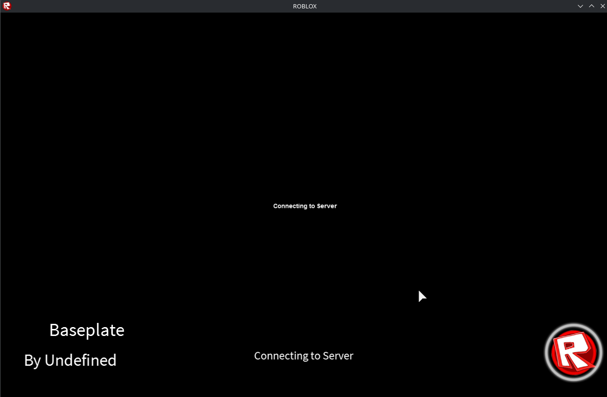

# Custom Roblox Loading-Screen
A custom Roblox loading screen made for 2014 clients, May also work for 2013 clients. Free to use.



# How to use
If you are Developing an Revival or something like that you most likely have an JoinScript

Copy everything from **LoadingScreen.lua** and paste it into your JoinScript.

Your JoinScript should start like this:

```lua
-- This is a joinscript that works in 2013 and earlier clients

function onPlayerAdded(player)
  -- override
end

pcall(function() game:SetPlaceID(1818, false) end)

local startTime = tick()
local connectResolved = false
local loadResolved = false
local joinResolved = false
local playResolved = true
local playStartTime = 0

local cdnSuccess = 0
local cdnFailure = 0

settings()["Game Options"].CollisionSoundEnabled = true
pcall(function() settings().Rendering.EnableFRM = true end)
pcall(function() settings().Physics.Is30FpsThrottleEnabled = false end)
pcall(function() settings()["Task Scheduler"].PriorityMethod = Enum.PriorityMethod.AccumulatedError end)
pcall(function() settings().Physics.PhysicsEnvironmentalThrottle = Enum.EnviromentalPhysicsThrottle.DefaultAuto end)

local threadSleepTime = 15

-- Paste the content of LoadingScreen.lua here
```

Now, find this part in your JoinScript:

```lua
  function requestCharacter(replicator)
  
  -- prepare code for when the Character appears
  local connection
  connection = player.Changed:connect(function (property)
    if property=="Character" then
      game:ClearMessage()
      waitingForCharacter = false
      
      connection:disconnect()
    
      if 0 then
        if not joinResolved then
          local duration = tick() - startTime;
          joinResolved = true
          
          playStartTime = tick()
          playResolved = false
        end
      end
    end
  end)
```

Right after this line:

if property=="Character" then

Add this:

clearLoadingScreen()

Thats it, it should work now.

Make sure that you have theses 2 png files in your textures folder:

Roblox-loading@2x.png
Roblox-loading-glow.png
